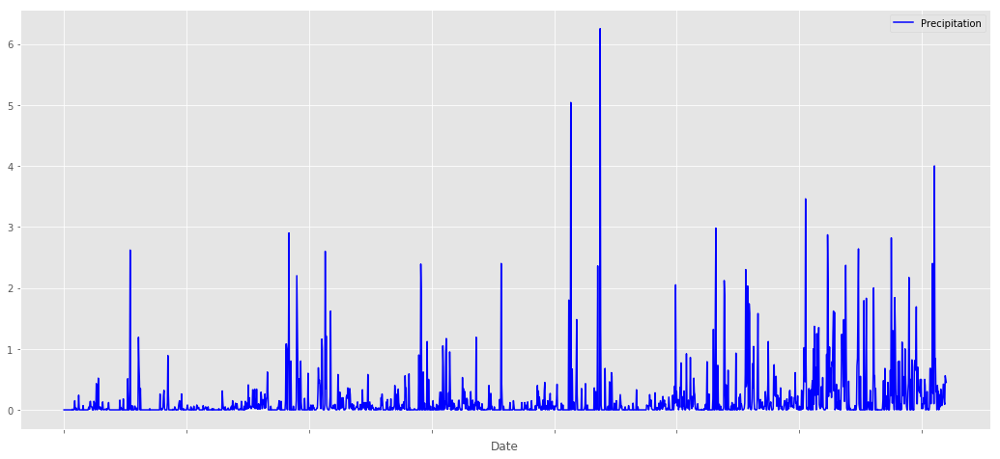
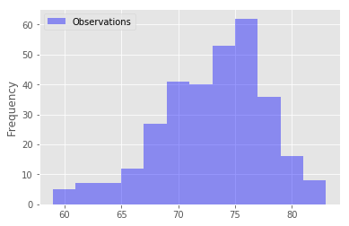
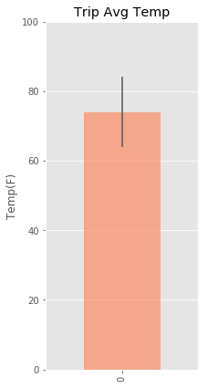

## Step 3 - Climate Analysis and Exploration


```python
# Import SQLAlchemy `automap` and other dependencies here
import sqlalchemy
from sqlalchemy.ext.automap import automap_base
from sqlalchemy.orm import Session
from sqlalchemy import create_engine, inspect
from sqlalchemy import desc
from sqlalchemy import func

import pandas as pd
import numpy as np
import matplotlib.pyplot as plt
from datetime import datetime
```


```python
# Create an engine for the `hawaii.sqlite` database
engine = create_engine("sqlite:///hawaii.sqlite")
```


```python
# Use automap_base() to reflect hawaii.sqlite DB tables into classes
Base = automap_base()
Base.prepare(engine, reflect = True)
session = Session(bind=engine)
Base.classes.keys()
```


    ['Measurements', 'Stations']


```python
# save a reference to the classes
Measurement = Base.classes.Measurements
Station = Base.classes.Stations
```


```python
# get date range for last 12 months of data
# start date
start_date = session.query(Measurement.date).order_by(desc(Measurement.date)).first()
start_date = np.ravel(start_date)[0]
# end_date
records = session.query(Measurement.date, func.avg(Measurement.prcp))\
          .group_by(func.strftime('%Y-%m', Measurement.date))\
          .order_by(Measurement.date.desc()).limit(12).all()
end_date = np.ravel(records[11])[0]
print(f'Start Date: {start_date} End Date: {end_date}')
```

    Start Date: 2017-08-23 End Date: 2016-09-30
    

## 1) Precipitation Analysis


```python
# retrieve the last 12 months of precipitation data
precipitation = session.query(Measurement.date, Measurement.prcp).filter(Measurement.date.between(end_date, start_date)).all()
```


```python
# load the results into a Dataframe
precipitation_df = pd.DataFrame.from_records(precipitation)
precipitation_df = precipitation_df.rename(columns={0: 'Date', 1: 'Precipitation'})
# Set the index to the Date column
precipitation_df = precipitation_df.set_index('Date')
print(precipitation_df.count())
precipitation_df.head()
```

    Precipitation    1801
    dtype: int64
    


<div>
<style scoped>
    .dataframe tbody tr th:only-of-type {
        vertical-align: middle;
    }

    .dataframe tbody tr th {
        vertical-align: top;
    }

    .dataframe thead th {
        text-align: right;
    }
</style>
<table border="1" class="dataframe">
  <thead>
    <tr style="text-align: right;">
      <th></th>
      <th>Precipitation</th>
    </tr>
    <tr>
      <th>Date</th>
      <th></th>
    </tr>
  </thead>
  <tbody>
    <tr>
      <th>2016-09-30</th>
      <td>0.0</td>
    </tr>
    <tr>
      <th>2016-10-01</th>
      <td>0.0</td>
    </tr>
    <tr>
      <th>2016-10-02</th>
      <td>0.0</td>
    </tr>
    <tr>
      <th>2016-10-03</th>
      <td>0.0</td>
    </tr>
    <tr>
      <th>2016-10-04</th>
      <td>0.0</td>
    </tr>
  </tbody>
</table>
</div>


```python
# Plot the results using the DataFrame
plt.style.use('ggplot')
precipitation_df.plot(figsize = (18,8), color = 'blue', rot = 340)
plt.show()
```





```python
# summary statistics for the precipitation data
precipitation_df["Precipitation"].describe()
```


    count    1801.000000
    mean        0.160589
    std         0.424107
    min         0.000000
    25%         0.000000
    50%         0.010000
    75%         0.120000
    max         6.250000
    Name: Precipitation, dtype: float64


## 2) Station Analysis


```python
# query to calculate the total number of stations
stations_count = session.query(Station.station, Station.name, Station.latitude, Station.longitude, Station.elevation).count()
stations_count
```


    9


```python
# query to find the most active stations
active_stations = session.query(Measurement.station, func.count(Measurement.tobs).label('Observations'))\
                  .group_by(Measurement.station).order_by(desc(func.count(Measurement.tobs))).all()
    
# List the stations and observation counts in descending order
active_stations
```


    [('USC00519281', 2772),
     ('USC00513117', 2696),
     ('USC00519397', 2685),
     ('USC00519523', 2572),
     ('USC00516128', 2484),
     ('USC00514830', 1937),
     ('USC00511918', 1932),
     ('USC00517948', 683),
     ('USC00518838', 342)]


```python
# station that has the highest number of observations
most_active = np.ravel(active_stations)[0]
most_active
```


    'USC00519281'


```python
# Filter by the station with the highest number of observations
observation_data = session.query(Measurement.station, Measurement.date, Measurement.tobs).\
filter(Measurement.date.between(end_date, start_date)).\
filter(Measurement.station == most_active).all()
```


```python
# load the results into a dataframe
observation_df = pd.DataFrame.from_records(observation_data)
observation_df = observation_df.rename(columns={0: 'Station', 1: 'Date', 2:'Observations'})
print(observation_df.count())
observation_df.head()
```

    Station         314
    Date            314
    Observations    314
    dtype: int64
    


<div>
<style scoped>
    .dataframe tbody tr th:only-of-type {
        vertical-align: middle;
    }

    .dataframe tbody tr th {
        vertical-align: top;
    }

    .dataframe thead th {
        text-align: right;
    }
</style>
<table border="1" class="dataframe">
  <thead>
    <tr style="text-align: right;">
      <th></th>
      <th>Station</th>
      <th>Date</th>
      <th>Observations</th>
    </tr>
  </thead>
  <tbody>
    <tr>
      <th>0</th>
      <td>USC00519281</td>
      <td>2016-09-30</td>
      <td>78</td>
    </tr>
    <tr>
      <th>1</th>
      <td>USC00519281</td>
      <td>2016-10-01</td>
      <td>77</td>
    </tr>
    <tr>
      <th>2</th>
      <td>USC00519281</td>
      <td>2016-10-02</td>
      <td>79</td>
    </tr>
    <tr>
      <th>3</th>
      <td>USC00519281</td>
      <td>2016-10-03</td>
      <td>79</td>
    </tr>
    <tr>
      <th>4</th>
      <td>USC00519281</td>
      <td>2016-10-04</td>
      <td>79</td>
    </tr>
  </tbody>
</table>
</div>


```python
# Plot the results as a histogram with bins=12
observation_df.plot.hist(by=observation_df.Observations, bins=12, color='blue', alpha = 0.4)
plt.ylabel("Frequency")
plt.show()
```





## 3) Temperature Analysis


```python
# define calc_temps to calculate and return min, avg, max temp for a specified range of dates
def calc_temps(start_date, end_date):
    records = session.query(func.max(Measurement.tobs).label('max_temp'), func.avg(Measurement.tobs).label('avg_temp')\
                                ,func.min(Measurement.tobs).label('min_temp'))\
                  .filter(Measurement.date.between(end_date, start_date)).all()
    return records
```


```python
records = calc_temps(start_date, end_date)
temperature_df = pd.DataFrame.from_records(records)
temperature_df = temperature_df.rename(columns={0: 'Max. Temp.', 1: 'Avg. Temp.', 2:'Min. Temp.'})
temperature_df
```


<div>
<style scoped>
    .dataframe tbody tr th:only-of-type {
        vertical-align: middle;
    }

    .dataframe tbody tr th {
        vertical-align: top;
    }

    .dataframe thead th {
        text-align: right;
    }
</style>
<table border="1" class="dataframe">
  <thead>
    <tr style="text-align: right;">
      <th></th>
      <th>Max. Temp.</th>
      <th>Avg. Temp.</th>
      <th>Min. Temp.</th>
    </tr>
  </thead>
  <tbody>
    <tr>
      <th>0</th>
      <td>87</td>
      <td>74.099944</td>
      <td>58</td>
    </tr>
  </tbody>
</table>
</div>


```python
# Plot the min, avg, and max temperature from your previous query as a bar chart
mean = temperature_df["Avg. Temp."]
err = (temperature_df["Max. Temp."] - temperature_df["Min. Temp."] ) * 0.35

# Set Graph Properties
fig, ax = plt.subplots()
mean.plot.bar(yerr=err, color='coral', width=0.5, ax=ax, figsize=(3,7), alpha=0.6)
plt.ylabel('Temp(F)')
plt.title("Trip Avg Temp")

plt.grid(False, axis='x')
plt.ylim(0,100)
# Save the figure
plt.savefig("Trip_Avg_Temp.png")
# Show Plot
plt.show()
```





## Step 4 - Climate App


```python
# 1. import Flask
from flask import Flask, jsonify
# 2. Flask Setup - create an app, being sure to pass __name__
app = Flask(__name__)
```


```python
# Complete the routes for your app here
# 3. Define what to do when a user hits the index route
@app.route("/")
def welcome():
    """List all available api routes."""
    return (
        f"Available Routes:<br/><br/>"
        f"/api/v1.0/precipitation - Precipitation<br/>"

        f"/api/v1.0/stations"
        f"- List of stations from the dataset<br/>"

        f"/api/v1.0/tobs"
        f"- Temperature Observations (tobs) for the previous year<br/>"

        f"/api/v1.0/&ltstart&gt"
        f"- Calculates MIN, AVG, and MAX temp. for all dates greater than and equal to the start date<br/>"

        f"/api/v1.0/&ltstart&gt/&ltend&gt"
        f"- Calculates MIN, AVG, and MAX temp. for a given start or start-end range<br/>"
    )
```


```python
@app.route("/api/v1.0/precipitation")
def precipitation():
    # prec_df = observation_df[["Date", "Observations"]]
    # prec_df = prec_df.set_index("Date")
    # return jsonify(prec_df.to_dict())
    return jsonify(precipitation_df.to_dict())
```


```python
@app.route("/api/v1.0/stations")
def stations():
    records = session.query(Station.station, Station.name).all()
    station_df = pd.DataFrame.from_records(records)
    station_df = station_df.rename(columns={0: 'Station', 1: 'Name'})
    return jsonify(station_df.to_dict())
```


```python
@app.route("/api/v1.0/tobs")
def tobs():
    tobs_df = observation_df[["Date", "Observations"]]
    tobs_df = tobs_df.set_index("Date")
    return jsonify(tobs_df.to_dict())
```


```python
def calc_temp_s(start_date):
    records = session.query(func.max(Measurement.tobs).label('max_temp'), func.avg(Measurement.tobs).label('avg_temp')\
                                ,func.min(Measurement.tobs).label('min_temp'))\
                  .filter(Measurement.date >= start_date).all()    
    return records[0]
```


```python
@app.route("/api/v1.0/<start>")
def temp(start):
    max_tmp, avg_tmp, min_tmp = calc_temp_s(start)
    temp_dict = {"Max. Temp.": max_tmp,
                 "Avg. Temp.": avg_tmp,
                 "Min. Temp.": min_tmp}
    return jsonify(temp_dict)
```


```python
@app.route("/api/v1.0/<start>/<end>")
def calc_temp_se(start, end):
    if datetime.strptime(start, '%Y-%m-%d') > datetime.strptime(end, '%Y-%m-%d'):
        records = calc_temps(start, end)
        max_tmp, avg_tmp, min_tmp = records[0]
        temp_dict = {"Max. Temp.": max_tmp,
                 "Avg. Temp.": avg_tmp,
                 "Min. Temp.": min_tmp}
        return jsonify(temp_dict)
    else:
        return "Please make sure Start Date is always greater than End Date."
```


```python
# Create your app.run statement here
if __name__ == '__main__':
    app.run()
```

     * Running on http://127.0.0.1:5000/ (Press CTRL+C to quit)
    127.0.0.1 - - [06/Feb/2018 22:52:13] "GET / HTTP/1.1" 200 -
    127.0.0.1 - - [06/Feb/2018 22:52:30] "GET /api/v1.0/2012-01-01 HTTP/1.1" 200 -
    127.0.0.1 - - [06/Feb/2018 22:52:46] "GET /api/v1.0/2012-01-01/2017-01-01 HTTP/1.1" 200 -
    127.0.0.1 - - [06/Feb/2018 22:52:59] "GET /api/v1.0/2017-01-01/2012-01-01 HTTP/1.1" 200 -
    127.0.0.1 - - [06/Feb/2018 22:53:04] "GET /api/v1.0/2012-01-01/2017-01-01 HTTP/1.1" 200 -
    127.0.0.1 - - [06/Feb/2018 22:53:05] "GET /api/v1.0/2012-01-01 HTTP/1.1" 200 -
    127.0.0.1 - - [06/Feb/2018 22:53:06] "GET / HTTP/1.1" 200 -
    127.0.0.1 - - [06/Feb/2018 22:53:19] "GET /api/v1.0/tobs HTTP/1.1" 200 -
    127.0.0.1 - - [06/Feb/2018 22:53:22] "GET / HTTP/1.1" 200 -
    127.0.0.1 - - [06/Feb/2018 22:53:33] "GET /api/v1.0/stations HTTP/1.1" 200 -
    127.0.0.1 - - [06/Feb/2018 22:53:36] "GET / HTTP/1.1" 200 -
    127.0.0.1 - - [06/Feb/2018 22:53:45] "GET /api/v1.0/precipitation HTTP/1.1" 200 -
    
